# ⚽ SPARK_LABS: WC2026 Live Tracker
**A real-time FIFA World Cup 2026 dashboard running entirely on a Shelly 1 Gen4 — no Home Assistant, no Node-RED, no cloud bridge.**

*Current Release: 1.0-beta | Target: Shelly 1 Gen4 (and other Gen4 devices with virtual component support)*

<div align="center">
  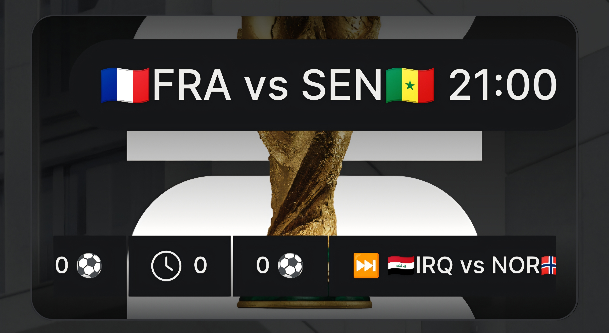
</div>

> 📁 *Note: Emoji rendering may vary between Android, iOS, and desktop — the glyphs are functionally identical across platforms.*

---

## ⚽ What is this?

WC2026 Live Tracker turns a Shelly 1 Gen4 into a self-contained World Cup dashboard inside the Shelly Smart Control app. It polls a live football API directly over HTTPS and renders a complete match-day display on the device card using Virtual Components — live scores, goal and card events with player names, an elapsed-minute progress bar, group standings, and next-match tickers.

The Shelly app is the UI. The device does everything itself. No external automation platform, no companion server, no cloud middleware. Just a Shelly device, a Wi-Fi connection, and an API key.

Once installed, the tracker appears in the Shelly ecosystem as a full virtual device — and because it runs on a standard Shelly relay, the physical switch still works as a switch.

> ⚠️ **Beta warning:** This is a proof of concept under active development. **Do not enable Run on Boot** — if the script encounters an issue on startup it may affect device availability. Start it manually, monitor the console, and only enable boot-start once you are satisfied it is stable on your device and network. Test at your own risk. BETA [API FOOTBALL PREMIUM](https://www.api-football.com/) SUPORT ONLY !!!
>
> **Not tested on devices running Matter or Zigbee protocols.** If your device has Matter or Zigbee enabled, behaviour is unknown — use a standard Wi-Fi only device.

---

<div align="center">
  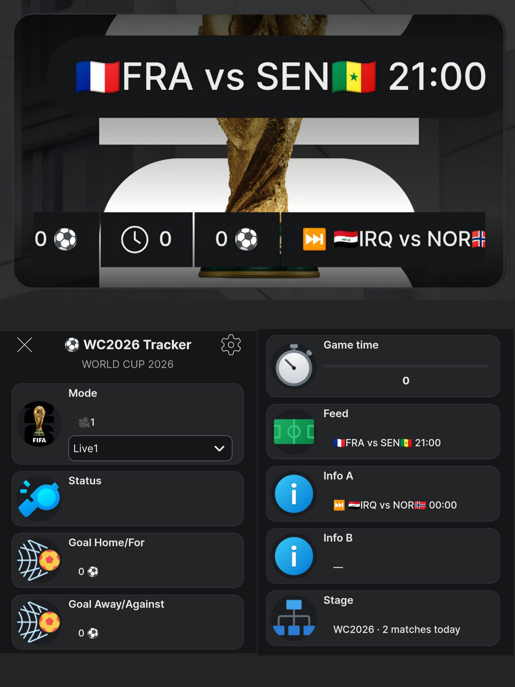
</div>

---

## 🔧 The Problem

Following the World Cup usually means a second screen — a phone app, a website, a TV ticker — and if you have a wife and three daughters, good luck getting the TV. Most matches kick off at ungodly hours anyway. None of it lives in your smart home. Your Shelly app knows your lights and your power consumption, but it has no idea there's a match on.

WC2026 Live Tracker fixes this. It turns a Shelly device into a live football appliance — the match comes to the same app you already use for your home, with goal alerts pushed straight to your phone, no TV required.

---

## 🚀 The Journey

It started as a skill test. Working with weather and energy APIs is great, but smart home automation deserves something more interesting. World Cup 2026 is this year — why not try sports API?

The first ideas were simple: dim the lights on kick-off, put the kettle on at half-time. Cool, but most matches are late at night, and the wife has a strict policy on lighting automations being tampered with. So the TV idea evolved into something bigger — I had the parts sitting around for a 2D LED curtain matrix planned for Christmas. Why not make a live scorecard on that?

But before animating a pixel matrix you need to visualise the data. You need to prove the API works and the live events land correctly. I could have used Home Assistant — but as a creative person HA is a rabbit hole I avoid and doesnt fit with my Goal to build a totally Shelly smart home, Shelly already has a great scripting engine with native Virtual Component dashboard. WLED integrates perfectly with Shelly scripts over local API. The idea was born.

**Then the problems started.**

football-data.org looked solid — a free tier and a paid option at $12/month, with the API cleanly abstracted between both. Building the UI was straightforward — Postman gave me a full picture of the response, and standard scoreboard logic mapped naturally onto Virtual Components. Then I counted the teams. 48. In WC2026 there are 48 teams.

Handling 48 teams and their flags in a config block is a mess. The first instinct was a favourites picker — let the user choose their teams and only track those. But building the team selection UI was another problem. Flags as emoji in enum options hit a length limit immediately. Building them dynamically looked impossible — then I Remembered a Shelly community script [shelly.guide](https://shelly.guide/scripting/shelly-rgbw-loop-controller-pluspro/)using an in-device HTTP server to serve a full HTML interface. That cracked it open. Suddenly I could render a proper team picker UI with flag images from a CDN, group-by-group, right from the device. The Shelly MCP server helped nail the exact API signatures. That moment — seeing a beautiful 48-team picker load from a microcontroller — was genuinely surprising.


<div align="center">
  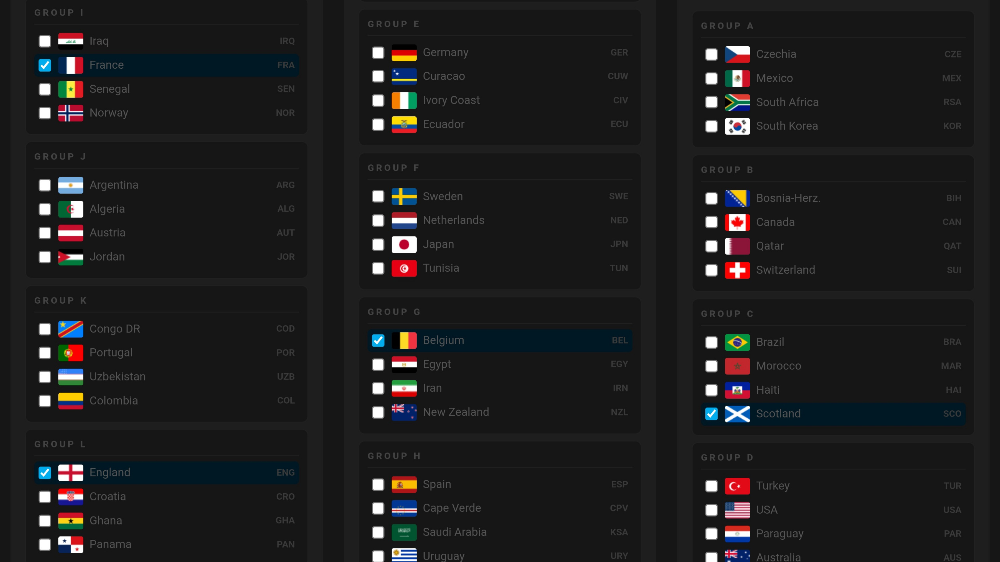
</div>


The free tier worked But after testing prior to Matchday 1, the limitations were obvious — no yellow or red cards, no goal scorer, no elapsed minute. The backup API was API-Football — no free tier, but $20/month and the response quality is a different world. Postman confirmed it immediately.

Then the full game responses landed. They are enormous. `JSON.parse` on the full fixture response worked for about 84 minutes — then the script stopped. Out of memory. Filtering the response helped, but not enough. The group standings endpoint crashed the buffer entirely. The solution was to stop parsing and storing the full response, and instead scan the raw string directly for only the fields that matter — a technique borrowed from stream processing. For standings, four sequential per-team API calls replaced one large response. Not the most efficient approach, but it fits in memory and it works.

By Day 3, three back-to-back matches ran stably. It was ready to share.

The rest is in the docs — it's a World Cup project, not a computer science paper. Each problem got solved and the tracker moved forward. That's the spirit of it.

---

## 🔀 How It Works

```
API-Football v3 (HTTPS)
        │
        ▼
   ┌──────────┐     KVS (boot-time config)
   │  Brain    │◄──── wc_auth · wc_timing · wc_teams · wc_grp_A..L
   │  Script   │
   └────┬──────┘
        │ handle.setValue()
        ▼
   Virtual Components ──► Shelly Device Card UI
        │
        ├──► Cloud push notifications (goals, cards, kick-off)
        │
        └──► /ctrl?cmd=state endpoint (planned WLED consumer)
```

The Brain is a persistent state machine. It polls the API on an interval that adapts to match state — fast during live play, slow when idle. Each poll extracts only the fields it needs, writes them to Virtual Components, and discards the response. Nothing is stored that does not need to be.

**The tracker is fully self-contained.** All processing runs on-device in mJS (Espruino-based JavaScript). The only external dependency is the football API itself.

> ⚠️ **Resource warning:** The WC2026 Brain is a heavy script by Shelly standards. It maintains a persistent poll timer, manages 9 virtual component handles, and makes multiple sequential HTTP calls during live matches. **Do not run it on a device that already hosts other scripts, existing virtual components, or serves a critical role in your smart home automation.** Dedicate a device to it — a Shelly 1 Gen4 on a non-essential circuit is ideal.
 
Once installed, the tracker appears in the Shelly ecosystem as a full virtual device — and because it runs on a standard Shelly relay, the physical switch still works as a switch.

---

## 💻 Hardware

| Component | Role |
|-----------|------|
| Shelly 1 Gen4 | Hosts the scripts and virtual components. Tested and confirmed on firmware 2.0.0-beta1. |
| Wi-Fi connection | The device polls the API directly over your network. |
| API-Football account *(Premium tier)* | Provides live scores, events, and standings. Free and basic tiers available via football-data.org. |

**Other Gen4 devices** with virtual component support and an internet connection should also work — the tracker uses no relay, metering, or physical I/O. The Shelly 1 Gen4 is the reference and test platform.

> ⚠️ **Important:** The device needs outbound HTTPS access to reach the API. Devices on isolated IoT VLANs may need a firewall rule permitting outbound traffic to the API host.

---

## ✨ Features

- **Live score tracking** — Polls every 30 seconds during matches. Home and away goals update on dedicated counters; elapsed minute drives a 0–120 progress bar.
- **Goal and card events** — Player name and minute for every goal and card, scanned live from the API events feed. Own goals, penalties, and missed penalties are distinguished.
- **Live1 / Live2 dual-game tracking** — Live1 follows whichever match is currently in play, with automatic fixture handoff at full time. Live2 shows a second concurrent match during simultaneous group-stage kick-offs, then auto-reverts to Live1 when the second game ends.
- **Team modes** — Track any selected team's fixtures through the tournament, with that team's group standings.
- **Group standings** — Live group table with flag and points, built on demand per displayed fixture.
- **Push notifications** — Cloud alerts to your phone for kick-off, goals (home and away), yellow cards, half-time, and pre-match countdown. Powered by the Shelly cloud notification system on the status component.
- **State machine** — Clean transitions through PRE → KO → LIVE → HT → FT, plus extra time and penalties for knockouts.
- **Full-time hold** — Holds the final score on screen after the whistle rather than jumping straight to the next fixture.
- **Reboot recovery** — The displayed fixture ID is cached in Script.storage and restored on warm boot.
- **API error hold** — A failed or truncated API call holds the last known display rather than flickering to idle.
- **Adaptive polling** — Poll rate scales with match state: 30s live, 120s pre-match, 600s idle. All rates are KVS-configurable without reflashing.
- **Memory-disciplined** — String-scanned event parsing (no `JSON.parse` on the events feed), deduplicated component writes, and self-stopping installer scripts keep the heap clear during live polling.

---

## 📱 Virtual Device UI

### Component Table

The tracker uses 9 virtual components grouped under a single virtual device.
## 📱 Virtual Device UI
 
### Component Table
 
The tracker uses 9 virtual components grouped under a single virtual device card.
 
| UI Component | Type | Function |
|---|---|---|
| **Mode** 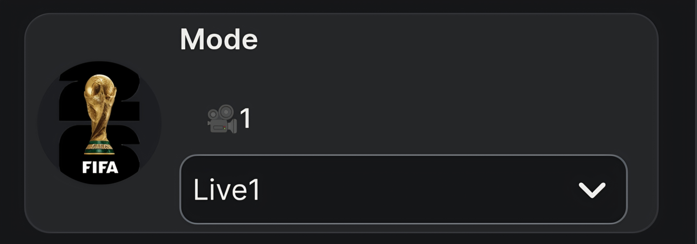 | Dropdown | Selects the tracking target — `Live1`, `Live2`, individual team TLAs, `Auto`, or `Error`. |
| **Status** 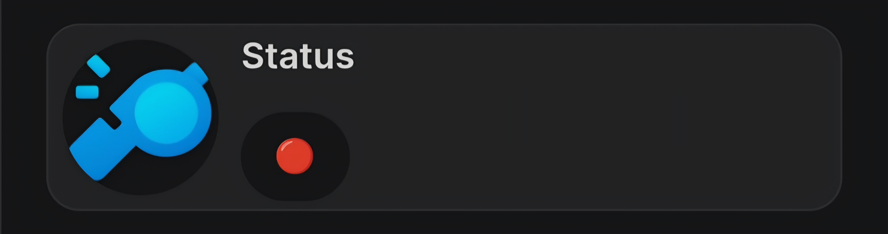 | Label | State pill with emoji glyph — `IDLE` / `PRE` / `KO` / `LIVE` / `HT` / `ET` / `PENS` / `FT` / `🟨` / `🟥`. Drives cloud push notifications. |
| **Goal Home/For** 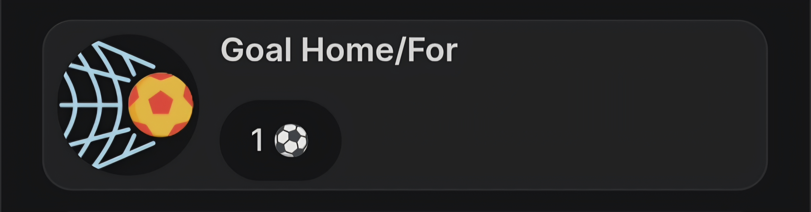 | Label | Home team goal counter. Resets to 0 on fixture change. |
| **Goal Away/Against** 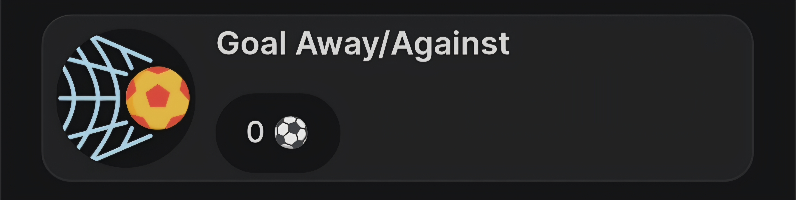 | Label | Away team goal counter. Resets to 0 on fixture change. |
| **Game time** 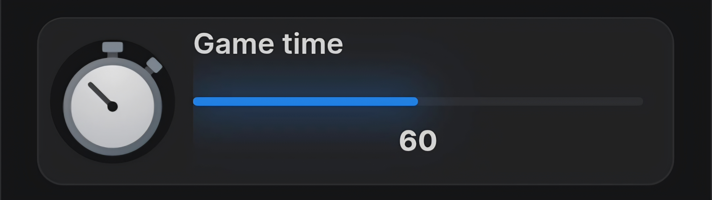 | Progress bar | Elapsed minutes (0–120). Advances through 1H, HT hold at 45, resumes for 2H and ET. |
| **Feed** 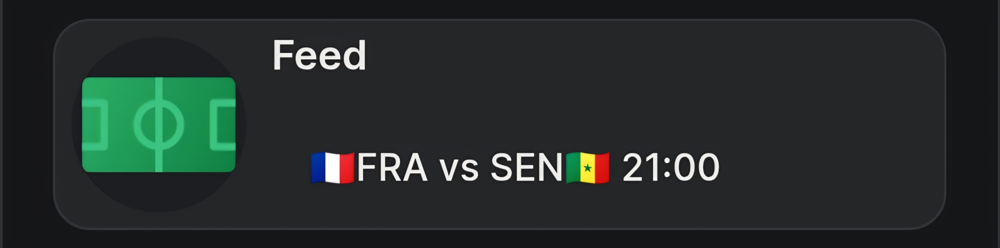 | Label | Match pair with emoji flags — e.g. `🇲🇽MEX vs RSA🇿🇦`. |
| **Info A** 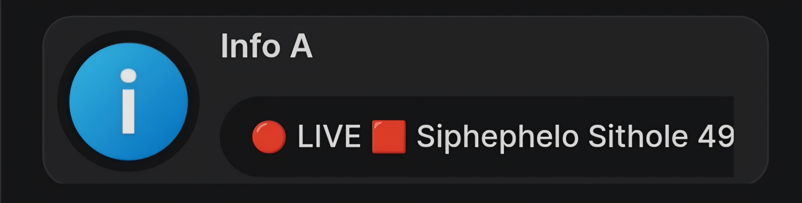 | Label | State and last event during live play — e.g. `🔴 LIVE ⚽ J. Quinones 9'`. Shows next fixture date when idle. |
| **Info B** 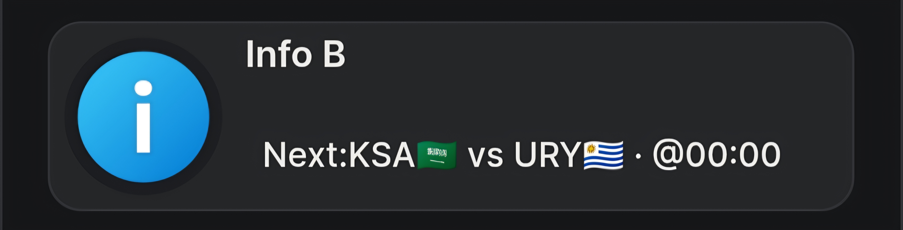 | Label | Next upcoming match ticker, or the second concurrent live match during dual-game windows. |
| **Stage** 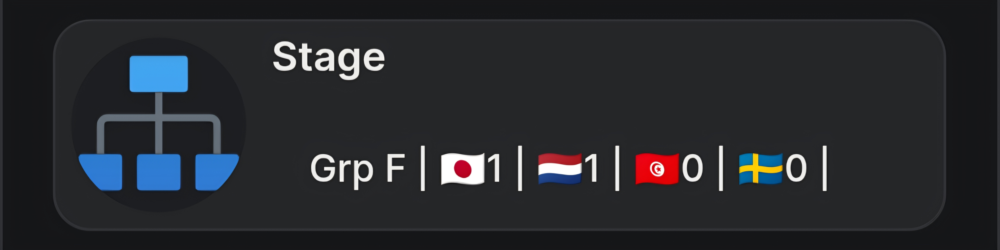 | Label | Group standings sorted by rank with flag and points — e.g. `Grp A \| 🇲🇽3 \| 🇰🇷3 \| 🇨🇿0 \| 🇿🇦0 \|`. Shows knockout round label in elimination stages. |
 

<div align="center">
  
</div>

### Status Glyphs

The Status component (`enum:201`) shows a state pill with an emoji glyph and carries the cloud push notifications.

**State glyphs:** 🏟 PRE · ⚽ KO · 🔴 LIVE · HT Half Time · ET Extra Time · 🥅 PENS · FT Full Time · 🟨 Yellow · 🟥 Red

### Text Format

**Feed (`text:200`)** — Match pair, flag-led home side:
```
🇲🇽MEX vs RSA🇿🇦
```

**Info A (`text:201`)** — State plus the last event, which persists until the next event:
```
🔴 LIVE ⚽ J. Quinones 9'
⏸️ HT ⚽ J. Quinones 9'
🏁 FT
```

**Info B (`text:202`)** — Next upcoming match, or the second live game during dual-game windows:
```
Next:KSA🇸🇦 vs URY🇺🇾 · @00:00
```

**Stage (`text:203`)** — Group standings, sorted by rank with flag and points:
```
Grp A | 🇲🇽3 | 🇰🇷3 | 🇨🇿0 | 🇿🇦0 |
```

> 📱 **Device note:** Some emoji render differently on Android compared to iOS or desktop. Subdivision flags (England 🏴󠁧󠁢󠁥󠁮󠁧󠁿 and Scotland 🏴󠁧󠁢󠁳󠁣󠁴󠁿) in particular vary by platform — the glyphs are functionally identical, only the visual style differs.

### Virtual Device Card Layout

Extract `group:200` as a Virtual Device *(Shelly Premium feature)* for the best card experience. All 9 components can be reordered freely in the Shelly app card customisation screen. The hero image at the top of this README shows a recommended layout with the trophy header and scorecard row.

---

## 🔔 Push Notifications

<div align="center">
  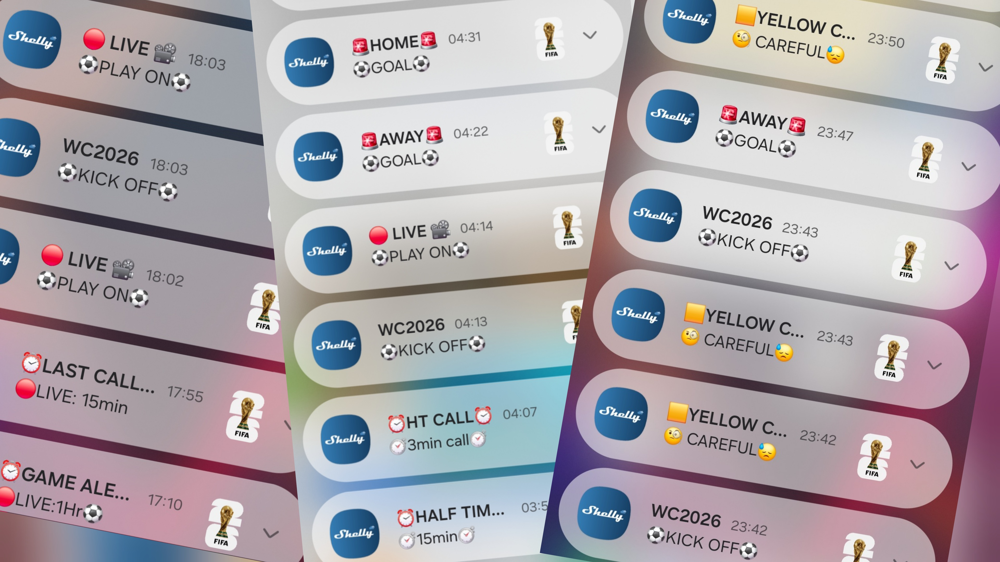
</div>

The tracker fires cloud push notifications to your phone for key match moments — kick-off, home and away goals, yellow card warnings, half-time, and pre-match countdown alerts. These are driven by the cloud notification configuration on the Status enum and arrive through the standard Shelly app notification channel.

No extra service is required — if your device is connected to Shelly Cloud and notifications are enabled in the app, the alerts arrive automatically.

---

## 📦 Repository Contents

### Release Scripts

| Script | Purpose | Run on boot |
|--------|---------|-------------|
| `WC2026_Installer.js` | Commissioning — tier selection, team picker, KVS seeding, VC provisioning. Self-stops on completion. | No — run once |
| `WC2026_LIVE_Beta.js` | Premium Brain. Live scores, events, Live1/Live2, full state machine. API-Football v3. | Yes — always |
| `WC2026_Tracker_Beta.js` | Basic/Free Brain. Date-bounded polling, no events feed. football-data.org. | Yes — always |
| `WC2026_API_Debug.js` | Connectivity tester. Four-step probe of the API endpoints. Stop and delete after use. | No — diagnostic |
| `WC2026_Demo.js` | Match replay tool. Replays a completed fixture on the device card for screenshots and recordings. Stop and delete after use. | No — demo only |

> ⚠️ **Choose one Brain.** Run the Premium Brain (`WC2026_LIVE_Beta.js`) with an API-Football key, or the Basic/Free Brain (`WC2026_Tracker_Beta.js`) with a football-data.org key. Do not run both at once — they write to the same virtual components.Please Note Free and basic are currenty untested and script works ONLY with API Football.

### Documentation

| File | Content |
|------|---------|
| `README.md` | This file |
| `WC2026_FW_Spec_v1_0.md` | Authoritative firmware specification — VC layout, KVS schema, API field reference |
| `CHANGELOG.md` | Version history |

---

## 🎯 Choose Your Tier

| Feature | Premium (API-Football) | Basic / Free (football-data.org) |
|---------|------------------------|----------------------------------|
| Live score tracking | Yes — 30s polls | Yes — date-bounded |
| Elapsed minute | Native from API | Calculated from kick-off |
| Goal / card events | Yes — player + minute | No |
| Event flashes & notifications | Yes | Limited |
| Live1 / Live2 dual game | Yes | Single Live mode |
| Group standings | Yes | Yes |
| Subscription | Pro tier | Free tier available |

The Premium tier is the full experience and the focus of this release. The Basic/Free tier is included for users who prefer football-data.org or want a no-cost option, with reduced live-event detail.

---

## 🚀 Installation

### Prerequisites

- A Shelly 1 Gen4 (or other Gen4 device with virtual component support), firmware 2.0.0-beta1 or later
- An API key — either an **API-Football v3** key (Premium) or a **football-data.org v4** key (Basic/Free)
- The device connected to Wi-Fi with outbound internet access
- *(For notifications)* The device connected to Shelly Cloud with app notifications enabled

> ⚠️ **Security — API key:** Your API key is stored in the device's KVS under `wc_auth`. It is used only for outbound calls from the device to the football API. Treat it as a credential — do not paste it into shared scripts, forum posts, or public repositories. The scripts in this repository ship with a placeholder (`YOUR_API_SPORTS_KEY_HERE`) that you replace with your own key.

---

### Step 1 — Flash the Installer

Create a new script on the device named `WC2026_Installer`, paste the contents of `WC2026_Installer.js`, and save.

### Step 2 — Configure via Web UI

Start the Installer and open the configuration page in a browser:

```
http://<device_ip>/script/<id>/ui
```

<div align="center">
  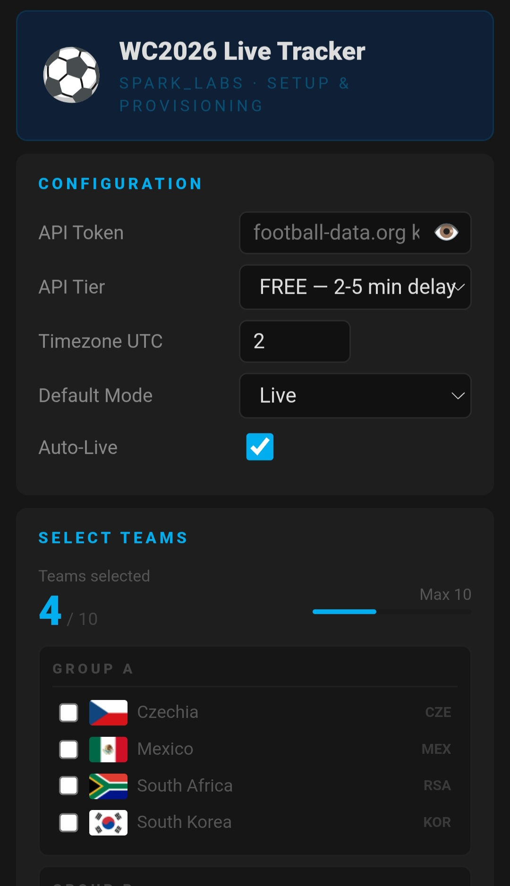
</div>

In the web UI:
- Enter your API token
- Select your tier (Premium / Basic / Free)
- Set your timezone offset (UTC hours)
- Choose your teams from the group-by-group picker (up to 10)
- Click install

The Installer writes all KVS keys, provisions the 9 virtual components, and self-stops to free heap.

### Step 3 — Flash the Brain

Create a new script in slot 1 named `WC2026 Live Tracker`. Paste the Brain that matches your tier:
- **Premium:** `WC2026_LIVE_Beta.js`
- **Basic/Free:** `WC2026_Tracker_Beta.js`

Set it to run on boot and start it. The Brain reads KVS, acquires the component handles, and begins polling.

> 💡 **The Brain prints its state endpoint URL on every boot:**
> ```
> [BRAIN] Endpoint: http://192.168.x.x/script/1/ctrl?cmd=state
> ```
> This is the read-only state feed for the planned WLED consumer.

### Step 4 — Clean Up

**Delete the Installer slot** once the Brain is running Delete the installer script for maximum headroom during live polling.

---

## 🗄️ KVS Reference

All configuration is read from KVS at boot. The Brain never writes config keys — only reads them. Seeded by the Installer.

| Key | Contents | Written by |
|-----|----------|------------|
| `wc_auth` | API token + provider identifier | Installer |
| `wc_timing` | Poll intervals, timezone offset, hold durations | Installer |
| `wc_teams` | Selected team IDs in priority order | Installer |
| `wc_grp_A` … `wc_grp_L` | Per-group team rosters (IDs + TLA codes), 12 keys | Installer |

Edit `wc_timing` values directly in the Shelly web UI (Advanced → KVS) to tune poll rates without reflashing the Brain. Restart the Brain after editing.

**Script.storage** — `fix_id` (1 slot): the displayed fixture ID, cached for warm-reboot recovery.


---

## ⚠️ Known Limitations

- **Full-time hold edge case** — On certain API state transitions, the display may skip the FT hold and move straight to the next fixture. Cosmetic; does not affect tracking.
- **Long team names** — Very long resolved names can deform the Feed line on narrow displays. Three-letter codes (TLAs) are the primary identifier; full names are only used as a fallback.
- **Standings during traffic spikes** — The per-team standings build uses four sequential API calls. During heavy World Cup API traffic, the group table may take a few seconds to populate.

---

## 🗺️ Roadmap

### Knockout Stage Update *(before 1 July)*

The Mode dropdown adapts as the tournament progresses. Round-of-16 modes (`R16A`–`R16H`, `QFA`–`QFD`) replace the team list for the knockout phase, then collapse to `QF1`–`QF4`, `SF1`, `SF2`, `Final` from quarter-finals onward — plus a persistent `Fav` mode following your favourite team through the bracket.

### Demo HTML UI

The match replay tool gains a web UI with a fixture picker and speed slider, replacing the current config-block approach.

### Script C — WLED Pixel Display

A WLED consumer reads the Brain's `/ctrl?cmd=state` endpoint and drives a pixel matrix with team colours and live score data.

### Future

- Per-team card tally on the Feed during half-time and full-time
- Stoppage-time indicator
- Penalty-event flash classification

---

## 🤝 Credits & Attribution

**Football Data — API-Football**
Live scores, fixtures, events, and standings are provided by [API-Football](https://www.api-football.com/) (api-sports.io). The Premium tier of this tracker depends on their v3 API. Please respect their terms of service and rate limits.

**Football Data — football-data.org**
The Basic/Free tier uses [football-data.org](https://www.football-data.org/). Thank you to Daniel Freitag for providing a free, accessible football data API to the community.

**Icons**
Component icons are provided by [Icons8](https://icons8.com). The icon URLs in the virtual component configuration use confirmed-working Icons8 links tested on Shelly hardware. Icons8 attribution is required under their free-use licence — please retain it if you use the default URLs or substitute your own Icons8 selections.

**World Cup Crest Icon**
The Mode dropdown icon uses the official World Cup crest served from [football-data.org](https://crests.football-data.org/).

**Shelly Script Foundation**
This tracker is built on patterns and examples from the official [Shelly Script Examples repository](https://github.com/ALLTERCO/shelly-script-examples) by Allterco Robotics. The KVS loader pattern, virtual component creation, and HTTP request handling are adapted from those examples.

**Shelly Virtual Components & API**
The Virtual Component API, the `Virtual.getHandle()` / `handle.setValue()` / `handle.on()` pattern, and the cloud notification system are all part of the [Shelly Gen2+ scripting platform](https://shelly-api-docs.shelly.cloud/). Thank you to Allterco for building a microcontroller platform powerful enough to run something like this on-device.

**Shelly Academy**
The deep understanding of the Shelly scripting engine, virtual components, and KVS that made this project possible came directly from [Shelly Academy](https://www.shelly.com/pages/academy). Thank you to all the instructors for the exceptional course content.

---

## 📝 Changelog

See [CHANGELOG.md](CHANGELOG.md) for the full version history.

### 1.0-beta — June 2026

- Initial public release
- Premium Brain (API-Football v3): live scores, goal/card events, Live1/Live2 dual-game tracking, group standings, full state machine
- Basic/Free Brain (football-data.org): date-bounded polling, score tracking, standings
- Unified Installer with tier selection, group-by-group team picker, KVS seeding, VC provisioning
- Cloud push notifications for kick-off, goals, cards, half-time
- API connectivity debug tool
- Match replay demo tool with Brain-identical UI output
- Reboot recovery, API error hold, adaptive polling, deduplicated VC writes
- Memory-disciplined: string-scanned event parsing, self-stopping installer

---

## 📄 License

MIT License — see [LICENSE](LICENSE) for details.

---

## Built on the Foundations of Shelly Academy

**⚡ SPARK_LABS** — **S**helly **P**owered **A**utomation **R**eliable **K**ontrol

Technician, Installer & Shelly Academy Graduate at Recowatt Malta

[github.com/Nc-eW22](https://github.com/Nc-eW22)

*Turning everyday Shelly devices into truly smart virtual devices and appliances.*
